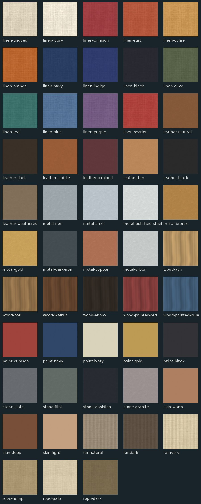

# Plank Fighter texture starter library

53 reusable color variants, each with three 512×512 PNG maps: basecolor (sRGB), tangent-space normal (linear), and packed ORM (R=ambient occlusion, G=roughness, B=metallic; read as linear). This makes 159 texture maps across linen, leather, metal, wood, paint, stone, skin, fur and rope. Three AI-generated source surfaces provide linen, leather and metal grain; variants and the remaining surface families were derived procedurally.

## Assignment by fighter

| Fighter | Main textile or wrap | Leather | Armor | Shafts / wood | Blade or edge | Separate core equipment |
|---|---|---|---|---|---|---|
| dienekes | linen-crimson | leather-dark | metal-bronze | wood-ash | metal-steel | aspis, dory |
| vorenus | linen-crimson | leather-natural | metal-iron | wood-oak | metal-steel | scutum, spear, gladius |
| freydis | linen-undyed | leather-natural | metal-iron | wood-oak | metal-steel | buckler, axe |
| anne | linen-navy | leather-dark | metal-steel | wood-walnut | metal-steel | cutlass, pistol |
| tomoe | linen-navy | leather-black | metal-dark-iron | wood-walnut | metal-steel | katana, yumi, arrow, saya |
| nai | linen-crimson | leather-natural | metal-gold | wood-ash | metal-steel | handwraps |
| hanzo | linen-indigo | leather-black | metal-dark-iron | wood-ebony | metal-steel | tanto, yari, kunai |
| subutai | linen-teal | leather-saddle | metal-iron | wood-ash | metal-iron | bow, quiver, knife |
| wyatt | linen-rust | leather-saddle | metal-dark-iron | wood-walnut | metal-steel | revolver |
| trooper | linen-olive | leather-dark | metal-dark-iron | wood-walnut | metal-dark-iron | rifle, knife, bayonet |
| chandos | linen-ivory | leather-dark | metal-steel | wood-oak | metal-steel | sword, shield |
| tzilacatzin | linen-ochre | leather-natural | metal-bronze | wood-oak | stone-obsidian | macuahuitl |
| mgobozi | linen-undyed | leather-dark | metal-iron | wood-oak | metal-iron | iklwa, shield |
| yuekong | linen-orange | leather-dark | metal-iron | wood-ash | wood-oak | staff |
| nihang | linen-blue | leather-black | metal-steel | wood-walnut | metal-steel | tulwar, chakram |
| shade | linen-black | leather-black | metal-dark-iron | wood-ebony | metal-steel | kunaiF, kunaiB, shuriken, hook |
| maori | linen-ochre | leather-natural | metal-iron | wood-oak | wood-walnut | taiaha, mere |
| ethiopia | linen-ivory | leather-natural | metal-gold | wood-walnut | metal-steel | shotel, gasha, rifle |
| duelist | linen-crimson | leather-black | metal-gold | wood-walnut | metal-polished-steel | smallsword, dagger |
| iceman | fur-natural | leather-weathered | metal-copper | wood-ash | stone-flint | axe, sling, flint |
| celt | linen-teal | leather-natural | metal-gold | wood-oak | metal-steel | longsword, shield, gaesum |
| persian | linen-crimson | leather-natural | metal-gold | wood-ash | metal-steel | spear, spara, bow, akinakes |
| lapulapu | linen-scarlet | leather-natural | metal-gold | wood-oak | metal-steel | kampilan, kalasag, bangkaw |
| iceni | linen-teal | leather-saddle | metal-bronze | wood-oak | metal-steel | spear, shield, torch |
| conquistador | linen-undyed | leather-dark | metal-polished-steel | wood-walnut | metal-steel | toledo, rodela, crossbow, standard |
| shanidar | fur-natural | leather-weathered | metal-iron | wood-ash | stone-flint | spear, stone |

## Mapping in Three.js / Blender

1. Match the body or weapon mesh to the recommended material in `fighter-assignments.json`. `materialNameRecommendations` lists real material names found in the exported GLBs; some materials are unnamed and need to be selected by mesh/appearance.
2. Load `*-basecolor.png` as an sRGB color texture, `*-normal.png` as linear normal data. The source albedo should replace the existing material color, or the color and texture will multiply and become too dark. Set material color to white unless intentionally tinting.
3. Load `*-orm.png` with linear color space. Connect G to roughness and B to metalness; use R as occlusion only when the mesh has a suitable secondary UV set. Three.js MeshStandardMaterial metalnessMap and roughnessMap both accept the same ORM texture (B and G channels respectively).
4. Use UV repeat and inspect a few limbs in the actual game camera. The current exported primitives have TEXCOORD_0, but many use primitive-generated UV islands rather than a shared authored character atlas. UV adjustment is still required for attractive, consistent scale and for custom shield art. Tiny meshes may need a solid color instead of dense woven detail.
5. Keep weapons separate and reuse the same families in every character. Test with game lighting; the diffuse source images contain subtle baked grain and the normal maps are heuristic height derivatives, not scan-grade physical surface data.

## Next textures needing unique art

- Large shield faces: lambda aspis, Roman scutum, Chandos heater arms, Zulu hide panel, Persian spara, and individual round shield markings. These need model-specific UV layouts and bespoke symbol overlays.
- Outfit details: Tomoe armor lacing, Freydís fur and braid, Anne coat trim, Hattori scarf, trooper webbing, Subutai deel and quiver, Tzilacatzin spotted pelt, and Yuekong robe.
- Weapon accents: bow wraps, spear grip bindings, etched sword fittings, axe inlays, rifle stock details, and staff end bands. These are detail decals over the shared families.

## Generation / provenance

Three image-generation calls produced source albedo fields: orthographic linen weave, leather grain and brushed metal. Source files are in `sources/`; `build_textures.py` deterministically prepares color variants and prototype normal/ORM maps. Wood grain and other surface families are code-generated. No externally sourced photos were used.

## Scope

This is a reusable material library plus 26 fighter assignments. It does not rewrite the GLBs, modify the live game, or guarantee that any texture will align with every current UV island. The normal and roughness maps are stylized approximations. The surface tiles are made edge-matching by code; preview each in a repeated material to judge visual seams.
