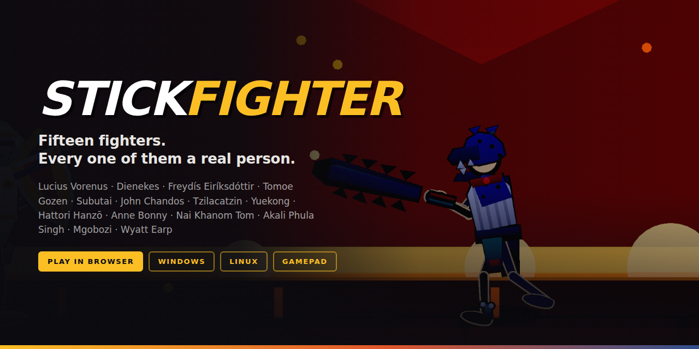

<p align="center">
  
</p>

<h1 align="center">Stick Fighter</h1>

<p align="center">
  A 2D fighting game in the browser, built on three.js.<br>
  Fifteen fighters, every one of them a person the historical record actually names,
  drawn as inked stick figures and armed with the weapon the sources give them.
</p>

<p align="center">
  <a href="https://skystrikerr.github.io/project_MKstickfight/"><b>▶ Play in your browser</b></a>
  &nbsp;·&nbsp;
  <a href="https://github.com/skystrikerr/project_MKstickfight/releases"><b>⬇ Download for Windows</b></a>
  &nbsp;·&nbsp;
  <a href="#controls"><b>🎮 Controller supported</b></a>
</p>

---

## Play

**In your browser** — nothing to install:
[skystrikerr.github.io/project_MKstickfight](https://skystrikerr.github.io/project_MKstickfight/)

**On Windows** — open
[Releases](https://github.com/skystrikerr/project_MKstickfight/releases), take
the newest one, and pick either:

| File | What it is |
|---|---|
| `Stick Fighter-x.y.z-portable.exe` | Single file. Double-click and play, installs nothing. |
| `Stick Fighter-x.y.z-x64.exe` | Installer. Adds a Start-menu and desktop shortcut. |

Windows will show a blue "Windows protected your PC" box the first time, because
the build is not code-signed. Click **More info → Run anyway**. Signing needs a
certificate from a certificate authority, which costs money annually; until that
exists, the warning is unavoidable for any independent release.

**On Linux** — the same release has an `.AppImage`. `chmod +x` it and run it.

These links point at the Releases *page* rather than `/releases/latest`, because
`latest` resolves to the newest **stable** release and every 0.x build is
flagged as a pre-release — so `latest` would 404 until 1.0.

The game is fully offline once you have it. There is no server, no account and
no network traffic of any kind.

### Versions

`0.x` means the game has not reached early access yet. `1.0` is reserved for
the early-access release, and nothing before it should be read as finished.
The current version is **0.2**.

## Controls

Two players share one keyboard, or plug in up to two gamepads — pads are
detected automatically, and a "gamepad connected" note appears when one is live.

**Gamepad** (standard mapping — Xbox, PlayStation, most third-party pads):

| Input | Action |
|---|---|
| D-pad / left stick | Move, jump, crouch |
| ✕ / A | Light attack |
| ○ / B | Medium attack |
| □ / X | Heavy attack |
| △ / Y, L1, L2 | Guard |
| R1 | Character skill |
| R2 | Throw |
| Start | Pause |

**Keyboard:**

| | Player 1 | Player 2 |
|---|---|---|
| Move / jump / crouch | `W` `A` `S` `D` | Arrow keys |
| Light / Medium / Heavy | `J` `K` `L` | `N` `M` `,` |
| Guard | hold `U` or `;` | `.` or Numpad&nbsp;0 |

Guard combines with a direction: `←` + Guard parries, `→` + Guard rolls through
an attack. `A + B` throws, `A + C` is the character's own skill.

Every fighter has five specials on motion inputs — `↓↘→` for quarter circles,
`→↓↘` for dragon punches — plus EX versions on the Guard button for 50 meter and
a super for 100.

## Training mode

Pick **Training** on the select screen. It is a room for holding a button down
and seeing what the move actually does:

- **Frame data for whatever you just threw** — startup, active and recovery,
  read off the move's own hitbox windows, plus its total length and damage.
- **A dummy that behaves** — stand, crouch, jump on a loop, hold guard, or
  fight back with the normal AI at the difficulty you picked.
- **Nothing runs out** — health refills once the dummy leaves hitstun (not
  during, so you can still read what a combo did), meter and character
  resources stay full, and the round clock never expires.
- **`R` resets** both fighters to their starting marks.

`F2` draws the hitboxes, in training or a real match.

## Building it yourself

```bash
npm install
npm run dev      # http://localhost:5173
npm run test     # headless simulation self-tests
npm run build    # typecheck + production bundle
```

## Desktop build

The game ships as a desktop app too. It is genuinely offline — there is no
server behind it, so the whole application is the static bundle plus an Electron
shell.

**To get a Windows `.exe`:** push a tag and let CI build it.

```bash
git tag v0.2.0 && git push origin v0.2.0
```

`.github/workflows/release.yml` builds on a real Windows runner and attaches
both an NSIS installer and a standalone portable `.exe` to the GitHub Release.
You can also run it by hand from the Actions tab — tick **Publish a GitHub
Release** and it tags the version in `package.json` and publishes it; leave it
unticked and the binaries are just downloadable artifacts on the run.

The binaries are about 104 MB each, which is over GitHub's 100 MB per-file
limit for anything committed with git. A Release is the only place in this
repository they can live, which is why there is no `releases/` folder.

**To test the current `main` without building it:**

```bash
npm run get:exe        # newest dev build -> ./release
npm run get:exe v0.2.0 # a specific tagged release instead
```

Every push to `main` rebuilds the game on a Windows runner and replaces the
files on the [`dev`](https://github.com/skystrikerr/project_MKstickfight/releases/tag/dev)
release, so this always fetches whatever is on `main` right now. It prints the
commit it came from, and skips the download if you already have that build.

**To build locally**, on the platform you are targeting:

```bash
npm run electron:dev   # run the shell against the Vite dev server
npm run dist:win       # -> release/Stick Fighter-0.2.0-x64.exe   (needs Windows)
npm run dist:linux     # -> release/Stick Fighter-0.2.0-x64.AppImage
npm run dist:mac       # -> release/Stick Fighter-0.2.0-x64.dmg   (needs macOS)
```

Cross-building Windows from Linux needs Wine and is not worth the trouble — the
CI workflow exists so you never have to.

One note if you touch `electron/main.cjs`: the bundle is served over a
registered `app://` scheme rather than loaded with `loadFile`. That is
load-bearing. The bundle is an ES module, and a module script fetched over
`file://` has an opaque origin, so Chromium blocks it by CORS and the window
comes up black with nothing but `ERR_FAILED` in the console.

## The roster

| Fighter | Era | Archetype |
|---|---|---|
| Lucius Vorenus | Nervii country, 54 BC | Zoner / Wall |
| Dienekes | Thermopylae, 480 BC | Grappler / Wall |
| Freydís Eiríksdóttir | Vinland, c. 1000 | Berserker / Bruiser |
| Tomoe Gozen | Awazu, 1184 | Footsies / Counter |
| Subutai | Kalka River, 1223 | Zoner / Charge |
| John Chandos | Poitiers, 1356 | Armoured Bruiser |
| Tzilacatzin | Tenochtitlan, 1521 | Rushdown / Mix-up |
| Yuekong | Jiangnan coast, 1553 | Zoner / Stance |
| Hattori Hanzō | Iga crossing, 1582 | Mix-up / Mobility |
| Anne Bonny | Negril Point, 1720 | Rushdown / Mix-up |
| Nai Khanom Tom | Ava, 1774 | Rushdown / Clinch |
| Akali Phula Singh | Punjab, 1807 | Zoner / Resource |
| Mgobozi ovela Ntla | Gqokli Hill, 1818 | Pressure / Footsies |
| Wyatt Earp | Tombstone, 1881 | Zoner / Punisher |
| The Ia Drang Trooper | Ia Drang Valley, 1965 | Zoner / Resource |

The last of these is the one deliberate exception: the unit, the valley and
every piece of the kit are real, but the man is a composite rather than a named
individual.

## How it is put together

```
src/game/stickfight/
  types.ts          every fighter is plain data - stats, poses, hitboxes, props
  constants.ts      the global rules: meter, guard, knockback, juggle decay
  skeleton.ts       joint angles -> world-space bone positions
  skins.ts          alternate colour schemes as a transform, not a second art set
  selftest.ts       headless simulation tests, run with `npm run test`
  engine/           the simulation: input buffer, fighter state, match, AI
  fighters/         one file per character
  render/           three.js: rig, stage, particles, post-processing
  ui/               React: select screen, HUD, move list, touch controls
```

The simulation is a fixed 60 Hz step and knows nothing about rendering. Adding a
fighter means adding one file in `fighters/` and listing it in `fighters/index.ts`
— the select screen, move list, AI and renderer are all driven off the data.

`npm run test` runs every matchup to completion under AI control and checks each
character honours the roster contract: five specials, a light, a heavy, a block,
a parry, a dodge, a throw, a skill and a super.
