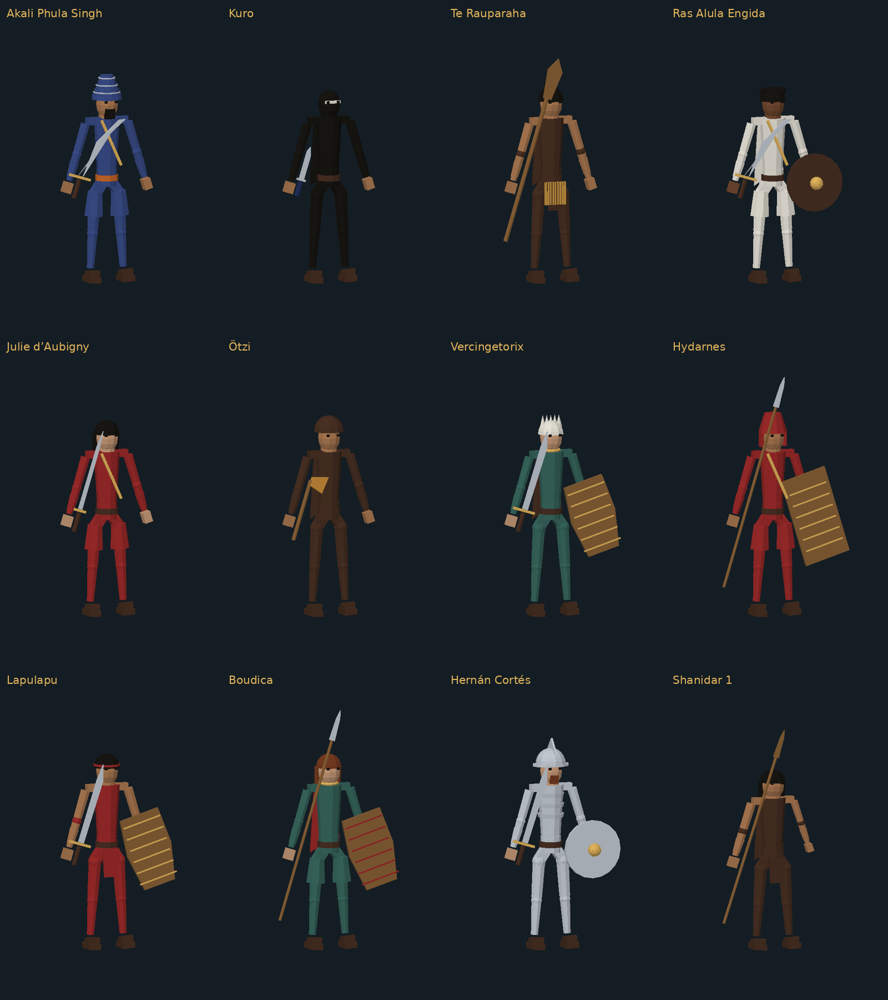

# Fighter prototype asset library

26 character packs. Each ZIP contains GLB models, source and an actual-mesh preview. Extract a pack to use its individual GLBs. These assets are not loaded by the game.

## Status

Rigid segmented prototypes: no skin weights, animation clips or painted texture maps. Equipment is separate from the body; assembled files are convenience previews. Existing move sets and runtime code are untouched. Core loadouts only: mounts, vehicles, animals and some special-move props still need work. Earlier approved prototypes retain their prior proportions; the newer models follow the slim connected-joint direction.

## Packs

- [dienekes-model-pack.zip](packs/dienekes-model-pack.zip)
- [vorenus-model-pack.zip](packs/vorenus-model-pack.zip)
- [freydis-model-pack.zip](packs/freydis-model-pack.zip)
- [anne-model-pack.zip](packs/anne-model-pack.zip)
- [tomoe-model-pack.zip](packs/tomoe-model-pack.zip)
- [nai-model-pack.zip](packs/nai-model-pack.zip)
- [hanzo-model-pack.zip](packs/hanzo-model-pack.zip)
- [subutai-model-pack.zip](packs/subutai-model-pack.zip)
- [wyatt-model-pack.zip](packs/wyatt-model-pack.zip)
- [chandos-model-pack.zip](packs/chandos-model-pack.zip)
- [trooper-model-pack.zip](packs/trooper-model-pack.zip)
- [mgobozi-model-pack.zip](packs/mgobozi-model-pack.zip)
- [yuekong-model-pack.zip](packs/yuekong-model-pack.zip)
- [tzilacatzin-model-pack.zip](packs/tzilacatzin-model-pack.zip)
- [persian-model-pack.zip](packs/persian-model-pack.zip)
- [shade-model-pack.zip](packs/shade-model-pack.zip)
- [nihang-model-pack.zip](packs/nihang-model-pack.zip)
- [lapulapu-model-pack.zip](packs/lapulapu-model-pack.zip)
- [conquistador-model-pack.zip](packs/conquistador-model-pack.zip)
- [celt-model-pack.zip](packs/celt-model-pack.zip)
- [ethiopia-model-pack.zip](packs/ethiopia-model-pack.zip)
- [maori-model-pack.zip](packs/maori-model-pack.zip)
- [iceni-model-pack.zip](packs/iceni-model-pack.zip)
- [duelist-model-pack.zip](packs/duelist-model-pack.zip)
- [iceman-model-pack.zip](packs/iceman-model-pack.zip)
- [shanidar-model-pack.zip](packs/shanidar-model-pack.zip)

## Latest additions

The twelve latest bodies were checked for separate equipment, connected hip meshes and finite transforms; all 59 corresponding GLBs loaded successfully. Earlier packs were validated during their individual creation turns.

## Integration

Use body GLBs for the fighter and attach separate equipment at named hand sockets. Retarget the game skeleton before animation testing. These are not drop-in skinned characters. Preserve gameplay timings and collision definitions while adapting visuals.
